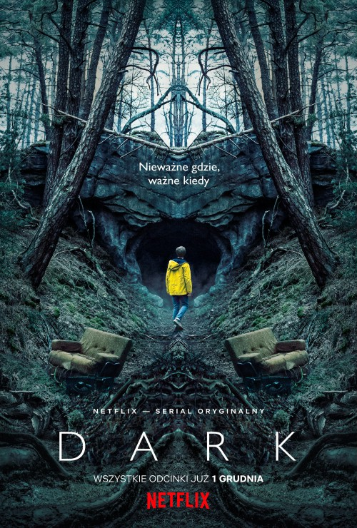

# Dark (serial telewizyjny)

"Dark" to niezwykła saga rozgrywająca się we współczesnych Niemczech. Zaginięcie dwojga małych dzieci wydobywa na światło dzienne skrywane sekrety czterech rodzin i zaburzone relacje pomiędzy ich członkami. Wypadki przedstawione w dziesięciu godzinnych odcinkach przybierają nadprzyrodzony obrót niepozostający bez związku z wydarzeniami, które miały miejsce w miasteczku w 1986 r.

<http://www.filmweb.pl/serial/Dark-2017-771383/descs>

#Plakat

# Odcinki wg. popularności

| ODCINEK | TYTUŁ ODCINKA                    | OBEJRZAŁO           |
|---------|----------------------------------|---------------------|
| 1       | Geheimnisse                      | 6 576 osób          | 
| 2       | Lügen                            | 5 949 osób          |   
| 3       | Gestern und Heute                | 5 681 osób          |  
| 4       | Doppelleben                      | 5 491 osób          |    
| 5       | Wahrheiten                       | 5 366 osób          | 
| 6       | Sic mundus creatus est           | 5 222 osoby         |
| 7       | Kreuzwege                        | 5 089 osób          |
| 8       | Was man sät, das wird man ernten | 4 968 osób          |
| 9       | Alles ist jetzt                  | 4 831 osób          | 
| 10      | Alpha und Omega                  | 4 706 osób          |

## ODCINK WG. POPULARNOŚCI

1. s01e08 - Was man sät, das wird man ernten- 8,34/10
2. s01e10 - Alpha und Omega- 8,34/10
3. s01e09 - Alles ist jetzt- 8,29/10
4. 01e06 - Sic mundus creatus est-  8,29/10
5. s01e05 - Wahrheiten- 8,26/10 
6. s01e07 - Kreuzwege- 8,24/10
7. s01e03 - Gestern und Heute- 8,05/10
8. s01e04 - Doppelleben- 8/10
9. s01e02 - Lügen- 7,98/10
10. s01e01 - Geheimnisse- 7,95/10

# Ciekawostki

+ Błąd: w odcinku S1E05 Dark podczas sceny, w której Bartosz z Jonasem grają na       Playstation 4 widać, że ich kontrolery są wyłączone.
+ kraj produkcji: Berlin (Niemcy)
+ Miejsce kręcenia: Serial kręcono w Berlinie (Niemcy).
+ Dark to pierwszy niemiecki serial, wyprodukowany przez Netflix.

# CYTAT

`" Aktorzy biorący udział w przedsięwzięciu byli dla mnie zupełnie anonimowi, lecz zagrało to na plus dla serwowanych na ekranie zdarzeń – każdego aktora i aktorkę odbierałem autentycznie, jako postać z miasteczka w Niemczech. Z tego profesjonalnego grona, kroki naprzód robią na pewno młody Louis Hofmann (Jonas) i Oliver Masucci (Ulrich), których postacie mają"najwięcej do powiedzenia" w tej historii."`- fragment recenzji napisanej na portalu filmweb

## KONIEC

library(tidyverse)

library(ggplot2)

ggplot(data = mpg) + 
  geom_histogram(mapping = aes(displ), binwidth = 0.2 ) +
  labs(title = "Rozkład pojemności silnika samochodów", x = "pojemność silnika", y = "liczba")
  

---
